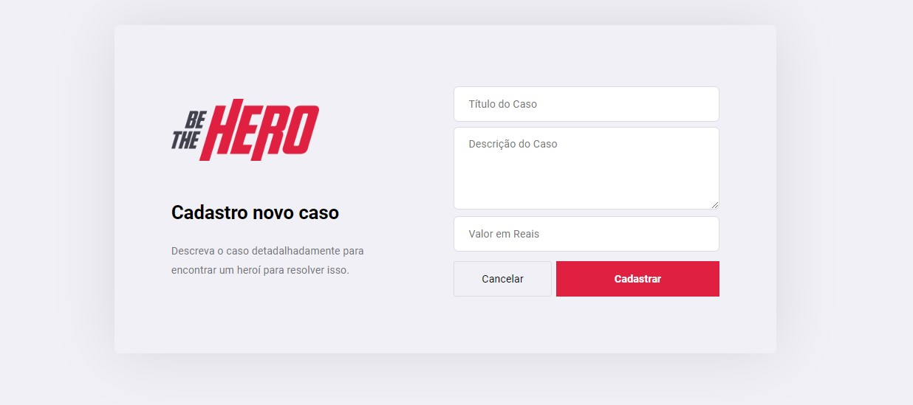

# Be The Hero

<h1>

</h1>

## Informations

- Create using React, Node, React Native and SQLite

<p align="center">  </p>

### Installations

Install in your computer the package manager [Yarn](https://yarnpkg.com/) or use Npm so that you can run this APP.

## Available scripts

- Executing ``` yarn install ``` in folders Mobile, Front-End and Back-End for install the dependencies.

- Executing ``` yarn start ``` in folders Front-End and Back-End for run application web. Acess: **http://localhost/3333**

- Executing ``` yarn start``` in folders Mobile and Back-End acess: **http://localhost:19002** e read the QR code in your cell and use the app Expo from run the version Mobile in your smartphone or use any emulation Android/Ios from run your computer.

## Screens Web

<p align="center">
    
    
    
    
</p>

## Screens Mobile

<p align="center">
    
    
    
    
</p>

## 
